<h3 align="center">INSTITUTO POLITÉCNICO NACIONAL</h3>
<h1 align="center">TAREA 1 - MCP Y SISTEMA DE ARCHIVOS</h1>

<br clear="all">

<p align="center"></p>

<p align="center"><b>Escuela:</b> Escuela Superior de Cómputo</p>

<p align="center"><b>Materia:</b> Aplicaciones móviles nativas</p>

<p align="center"><b>Actividad:</b> Investigación e implementación de un servidor MCP de sistema de archivos</p>

<p align="center"><b>Nombre completo:</b><br>Caballero Pérez Julio César</p>

<p align="center"><b>Número de boleta:</b> 2023630158 </p>

<p align="center"><b>Grupo:</b> 7CV4</p>

<p align="center"><b>Fecha de entrega:</b> 20 de septiembre de 2026</p>

<hr>

## Resumen de la actividad

Esta actividad estudia cómo un modelo de lenguaje pasa de estar aislado a poder operar sobre archivos locales mediante el Model Context Protocol (MCP), distingue MCP de una API tradicional e implementa, verifica y documenta la instalación de un servidor MCP de sistema de archivos en un cliente real.

- **Parte 1 (investigación):** Se documenta en la carpeta `docs/`, con un archivo por cada uno de los siete puntos solicitados.

- **Parte 2 (implementación):** Se instaló el servidor `@modelcontextprotocol/server-filesystem` en Visual Studio Code con GitHub Copilot, se delimitó un directorio de trabajo dedicado (`C:\mcp-tarea`), se ejecutaron las cinco operaciones solicitadas y se probó el límite de seguridad. Durante la instalación se encontró que el cliente reemplaza los directorios permitidos por su carpeta de trabajo
.
- **Parte opcional (servidor propio):** no se realizó.

**Versión de la especificación consultada:** Model Context Protocol, revisión 2026-07-28 (publicada el 28 de julio de 2026), consultada el 20 de septiembre de 2026.

## Índice

- [Documentos de la investigación](#documentos-de-la-investigación)
- [Estructura del repositorio](#estructura-del-repositorio)
- [Tabla comparativa: MCP frente a una API](#tabla-comparativa-mcp-frente-a-una-api)
- [Cliente elegido y justificación](#cliente-elegido-y-justificación)
- [Instalación paso a paso](#instalación-paso-a-paso)
- [Evidencias](#evidencias)
- [Conclusiones personales](#conclusiones-personales)
- [Seguridad del repositorio y control de versiones](#seguridad-del-repositorio-y-control-de-versiones)
- [Referencias](#referencias)

## Documentos de la investigación

| Punto | Tema | Documento |
|---|---|---|
| 1 | Evolución de los modelos: de LM a LLM y modelos con razonamiento explícito | [docs/README_Evolucion.md](docs/README_Evolucion.md) |
| 2 | El problema del aislamiento | [docs/README_Aislamiento.md](docs/README_Aislamiento.md) |
| 3 | MCP frente a una API | [docs/README_MCPvsAPI.md](docs/README_MCPvsAPI.md) |
| 4 | Arquitectura de MCP | [docs/README_Arquitectura_MCP.md](docs/README_Arquitectura_MCP.md) |
| 5 | El servidor de sistema de archivos | [docs/README_SistemaArchivos.md](docs/README_SistemaArchivos.md) |
| 6 | Seguridad | [docs/README_Seguridad.md](docs/README_Seguridad.md) |
| 7 | Casos de uso | [docs/README_CasoUso.md](docs/README_CasoUso.md) |

## Estructura del repositorio

```text
.
├── README.md      Documento principal
├── docs/          Investigación (archivos .md)
├── config/        Archivos de configuración utilizados, sin credenciales
├── LICENSE        Licencia MIT
└── img/           Logos de la escuela y capturas de pantalla
```
## Tabla comparativa: MCP frente a una API

| Criterio | API (por ejemplo, REST) | MCP |
|---|---|---|
| Quién decide qué se invoca | La persona que desarrolla, al escribir el código | El modelo, en tiempo de ejecución, según lo que pidió el usuario; la aplicación anfitriona ejecuta y solicita consentimiento |
| Cómo se descubren las capacidades | Mediante documentación o una especificación estática (por ejemplo, OpenAPI) leída en desarrollo | El servidor publica su catálogo con `tools/list` y el cliente lo consulta en ejecución |
| Acoplamiento cliente-servicio | Alto: el cliente codifica los endpoints, parámetros y formatos de cada servicio | Bajo respecto a cada servicio: el cliente implementa el protocolo una vez y se conecta a cualquier servidor |
| Formato de los mensajes | Propio de cada servicio (en REST, HTTP con URL y métodos) | JSON-RPC 2.0 uniforme (`tools/list`, `tools/call`) |
| Autenticación y consentimiento | Cada servicio define la suya (claves, tokens, OAuth); el consentimiento no forma parte del contrato | Para transportes HTTP, la especificación de autorización se apoya en OAuth; el consentimiento antes de invocar herramientas es un principio de la especificación, implementado por el anfitrión |
| Reutilización entre aplicaciones | Cada integración se programa para un servicio y una aplicación (N × M) | Un servidor sirve a cualquier cliente compatible (N + M) |
| Estado | REST no conserva estado entre peticiones | Desde la revisión 2026-07-28, solicitudes autocontenidas; antes mantenía sesiones |

**1. ELECCIÓN DEL CLIENTE**

**Cliente elegido:** Visual Studio Code con GitHub Copilot (modo agente), versión 1.138.0 ,sobre Windows 11 versión 25H2 (compilación 26200.9457).

### Justificación

1. **Es el entorno donde se desarrolla el proyecto.** Como además de esta práctica se desarrollará un proyecto con la herramienta, se buscó un cliente que también fuera un entorno de desarrollo completo. En VS Code se redactan la documentación y el código, se usa la terminal y se lleva el control de versiones. En modo agente, Copilot planifica el trabajo, determina los archivos y el contexto relevantes, edita el código e invoca herramientas (Microsoft, s. f.-c).

2. **Soporta MCP con una configuración transparente.** Los servidores se definen en un archivo `mcp.json`, ubicado en el espacio de trabajo (`.vscode/mcp.json`) o en el perfil de usuario, con autocompletado para editarlo. El archivo tiene una sección `servers` con los servidores y una sección opcional `inputs` para datos sensibles como claves.

3. **Facilita verificar el servidor y sus herramientas.** VS Code permite iniciar, detener, deshabilitar y consultar los registros de cada servidor, por ejemplo con el comando `MCP: List Servers`. Un servidor deshabilitado no arranca y sus herramientas quedan fuera del chat. Además, el agente cuenta con un selector para configurar qué herramientas puede usar.

4. **Incorpora seguridad.** Si la persona no confía en un servidor, este no se inicia y el chat continúa sin sus herramientas. Antes de una llamada a una herramienta, el agente puede pedir aprobación, y la persona debe revisar la acción y aprobarla si corresponde con la tarea. Esto permite documentar la confirmación humana descrita en la sección 6.

5. **Es accesible.** El plan gratuito de GitHub Copilot admite el modo agente, aunque con límites de uso que pueden cambiar.

6. **Permite ampliar el trabajo.** El mismo editor sirve para escribir, ejecutar y conectar un servidor MCP propio.

### Limitaciones de la elección

- El modo agente requiere una cuenta de GitHub con acceso a Copilot y está sujeto a cuotas de uso.
- Ejecutar el servidor con `npx` requiere tener Node.js instalado.
- El agente tiene herramientas integradas propias; deben distinguirse de las del servidor MCP al documentar las pruebas.

### Actualización de la sección 4.1 (roles en el ejemplo instalado)

| Rol | Quién lo cumple  |
|---|---|
| Host | Visual Studio Code con GitHub Copilot: la aplicación con la que se conversa, que contiene el chat y muestra las solicitudes de aprobación |
| Cliente MCP | Componente interno de VS Code que el host crea para hablar con el servidor `filesystem` |
| Servidor MCP | El paquete `@modelcontextprotocol/server-filesystem`, que el host lanza con `npx` como proceso hijo |
| Modelo | El modelo seleccionado en el chat de Copilot, que decide qué herramienta conviene usar |
| Usuario | Formula la petición y aprueba cada operación antes de que se ejecute |

## Instalación paso a paso

### Entorno utilizado

| Componente | Versión |
|---|---|
| Sistema operativo | Windows 11 versión 25H2 (compilación 26200.9457) |
| Visual Studio Code | 1.138.0 |
| GitHub Copilot | Plan Copilot Free, modo Agent |
| Node.js | v24.20.0 |
| npm / npx | 11.19.0 |
| `@modelcontextprotocol/server-filesystem` | 2026.8.31 |
| Especificación de MCP | 2026-07-28 |

### Requisitos previos

1. **Visual Studio Code actualizado.**
2. **GitHub Copilot activo.** En la barra de estado de VS Code, pasar el cursor por el ícono de Copilot, elegir **Use AI Features** e iniciar sesión con la cuenta de GitHub (Microsoft, s. f.-d). Sin suscripción, la cuenta queda en el plan gratuito.
3. **Node.js (versión LTS).** Comprobar con `node -v` y `npx -v`.
4. **Versión del servidor.** Comprobar con:

```powershell
npm view @modelcontextprotocol/server-filesystem version
```

Debe ser posterior a 2025.7.1, ya que corrige las vulnerabilidades EscapeRoute (Beber, 2026). En esta práctica se usó la 2026.8.31.

### Paso 1: crear el directorio de trabajo

Crear la carpeta `C:\mcp-tarea`. No es la raíz del disco ni la carpeta de usuario, y su nombre no lleva espacios. Dentro crear estos archivos de prueba:

`C:\mcp-tarea\notas.txt`
```text
Notas de la práctica MCP
Servidor: filesystem
Pendiente: probar lectura, escritura y búsqueda de archivos.
```

`C:\mcp-tarea\Proyecto\idea.md`
```markdown
# Idea del proyecto
Por definir.
```

Para la prueba del límite se creó además un archivo **fuera** del directorio autorizado: `fuera-de-limite.txt`, en la carpeta del repositorio, con el texto "Este archivo está fuera del directorio autorizado".

### Paso 2: abrir la carpeta de trabajo en su propia ventana

1. En VS Code, *File > New Window*.
2. *File > Open Folder…* y elegir `C:\mcp-tarea`.
3. Aceptar la confianza en los autores de la carpeta: mientras aparece **Restricted Mode**, VS Code no inicia servidores.

Este paso es indispensable: el directorio autorizado depende de la carpeta que la ventana tenga abierta (véase [el hallazgo](#hallazgo-las-roots-reemplazan-a-los-argumentos)).

### Paso 3: crear el archivo de configuración

Con `Ctrl+Shift+P` ejecutar **MCP: Open Workspace Folder Configuration**, que abre `.vscode/mcp.json`. Pegar y guardar:

```json
{
  "servers": {
    "filesystem": {
      "command": "npx",
      "args": [
        "-y",
        "@modelcontextprotocol/server-filesystem",
        "${workspaceFolder}"
      ]
    }
  }
}
```

`${workspaceFolder}` equivale a `C:\mcp-tarea` en esta ventana. Si `npx` no se resuelve en Windows, cambiar el comando a `"cmd"` y anteponer `"/c", "npx"` a los argumentos, como indica el README del servidor (Model Context Protocol, s. f.). Una copia de este archivo, sin credenciales, se guarda en [`config/mcp.json`](config/mcp.json).

### Paso 4: iniciar el servidor

Pulsar **Start** sobre el bloque `filesystem`. La primera vez, `npx` descarga el paquete y el registro muestra durante unos segundos el mensaje `Waiting for server to respond to initialize request...`; es normal. El servidor está listo cuando el estado cambia a **Running**.

### Paso 5: verificar que el cliente reconoce el servidor y lista sus herramientas

1. Sobre el bloque `filesystem` debe aparecer **Running | Stop | Restart | 14 tools**.
2. El registro (salida `MCP: filesystem`) debe incluir `Secure MCP Filesystem Server running on stdio` y `Discovered 14 tools`. Las líneas del servidor se marcan como `[warning]` porque el servidor escribe sus mensajes por el canal de errores; no indican un fallo.
3. Con `Ctrl+Shift+P` ejecutar **Configure Tools**: el servidor aparece como `secure-filesystem-server`.

### Paso 6: aislar la evidencia

En **Configure Tools**, desmarcar el grupo **Built-In** y **Python**, y dejar marcado solo `secure-filesystem-server`. Así el agente no puede usar herramientas integradas en lugar del servidor MCP. El cambio es global para los chats de Copilot, por lo que al terminar las pruebas se vuelven a marcar.

### Paso 7: comprobar el directorio autorizado

En el chat de Copilot, en modo **Agent**:

```text
Usa la herramienta list_allowed_directories del servidor filesystem y dime qué directorios tienes permitidos.
```

El chat respondió que el servidor permite acceder a `mcp-tarea` y a sus subdirectorios.

### Hallazgo: las roots reemplazan a los argumentos

En el primer intento, el servidor se configuró desde la carpeta del repositorio con el argumento `${workspaceFolder}/sandbox`. El registro mostró `Updated allowed directories from MCP roots: 1 valid directories` y `list_allowed_directories` devolvió la carpeta completa del repositorio, no `sandbox`. La razón está documentada: cuando el cliente soporta *roots*, estas reemplazan por completo los directorios permitidos definidos en el servidor (Model Context Protocol, s. f.), y existe un reporte abierto sobre el descarte silencioso de los argumentos (modelcontextprotocol/servers, 2026). VS Code envía su carpeta de trabajo como root, por lo que esta sobrescribió a `sandbox`.

La documentación de MCP aclara que las roots son un mecanismo de coordinación y no una frontera de seguridad (Model Context Protocol, 2026c). La solución fue hacer que la carpeta abierta en la ventana coincidiera con el directorio deseado (Paso 2), de modo que roots y argumento apunten al mismo lugar.

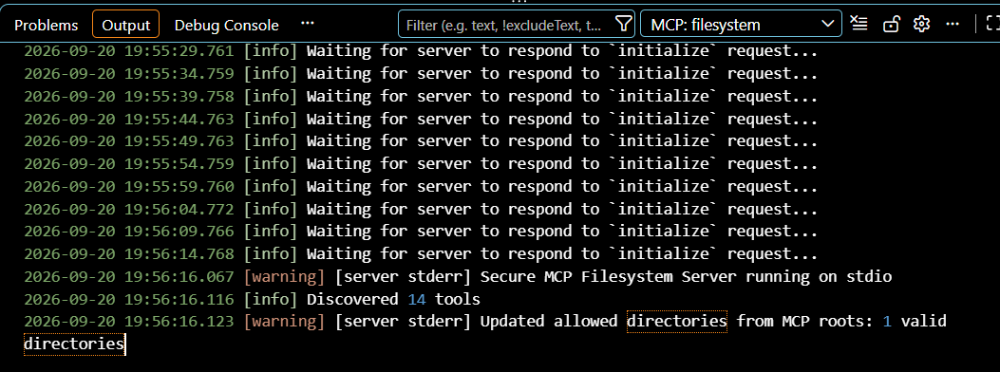

## Evidencias

### Verificación del servidor

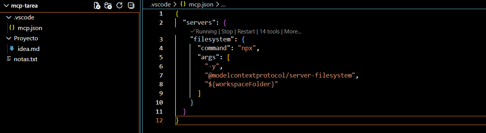

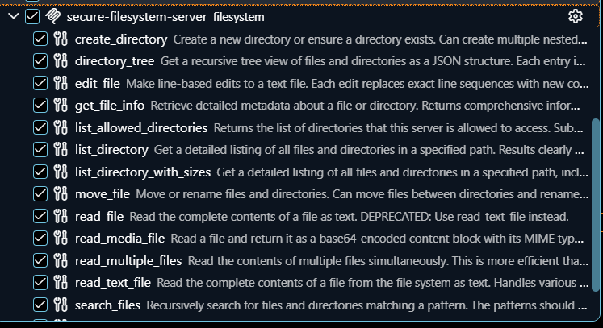

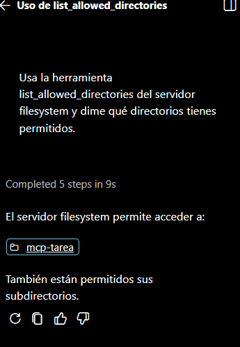

### Operaciones sobre el directorio autorizado

Antes de cada escritura se capturó la solicitud de aprobación, como evidencia de la confirmación humana.

**1. Listar el contenido del directorio autorizado**

```text
Usa la herramienta list_directory del servidor filesystem para listar el contenido del directorio permitido. No uses ninguna otra herramienta.
```

Se listaron `.vscode`, `Proyecto` y `notas.txt`.

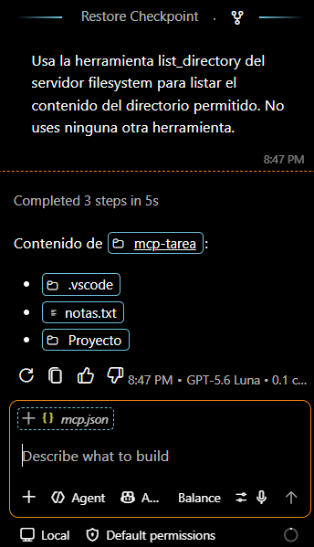

**2. Leer un archivo existente**

```text
Usa la herramienta read_text_file para leer el archivo notas.txt del directorio permitido y muéstrame su contenido exacto.
```

Se mostró el contenido de `notas.txt`.

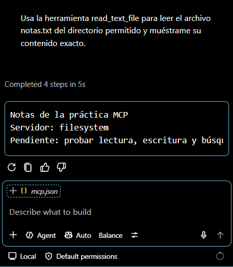

**3. Crear un archivo nuevo y escribir contenido en él**

```text
Usa la herramienta write_file para crear un archivo nuevo llamado tareas.md en el directorio permitido con este contenido:

# Lista de tareas
- Probar la lectura de archivos
- Probar la búsqueda de archivos
```

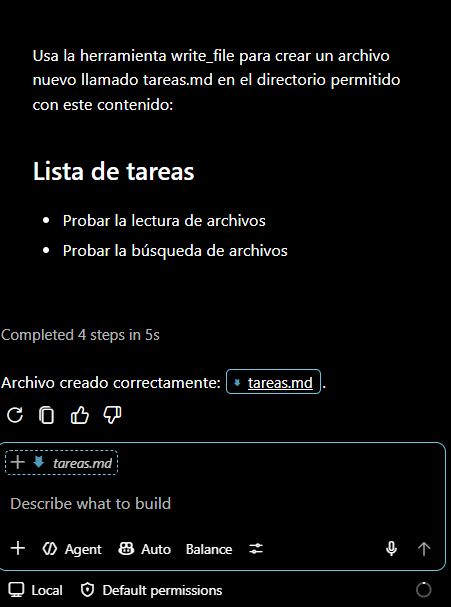

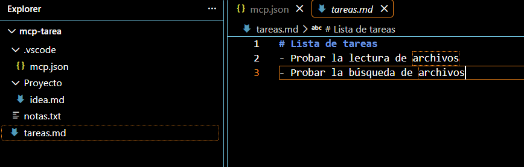

**4. Modificar un archivo existente**

```text
Usa la herramienta edit_file para modificar notas.txt: cambia la palabra "Pendiente" por "Completado". No cambies nada más.
```

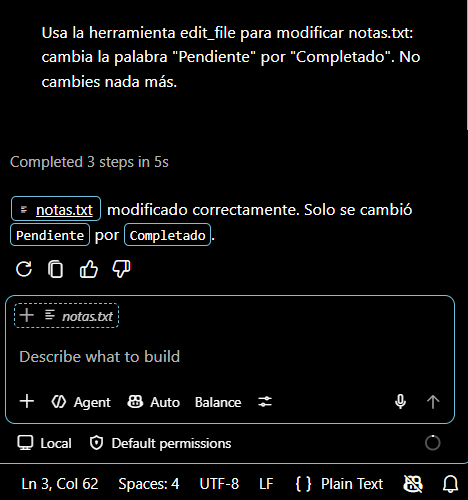

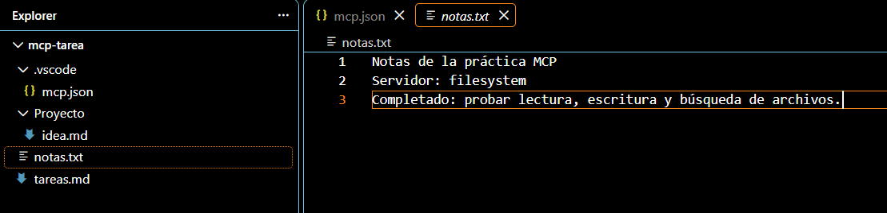

**5. Buscar un archivo por nombre**

```text
Usa la herramienta search_files para buscar en el directorio permitido todos los archivos cuyo nombre termine en .md.
```

Se encontraron `Proyecto\idea.md` y `tareas.md`. La herramienta `search_files` busca por nombre (Model Context Protocol, s. f.).

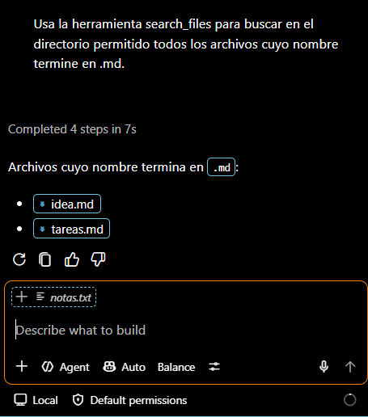

### Prueba del límite de seguridad

Se solicitó al modelo leer `fuera-de-limite.txt`, ubicado en la carpeta del repositorio y por tanto fuera del directorio autorizado `C:\mcp-tarea`. Se pidió expresamente llamar a la herramienta para obtener el mensaje del servidor y no una negativa del modelo.

```text
Usa la herramienta read_text_file del servidor filesystem para leer este archivo: [ruta completa de fuera-de-limite.txt]
Aunque creas que no tienes permiso, llama a la herramienta de todos modos. Quiero ver el mensaje exacto de error que devuelve el servidor.
```

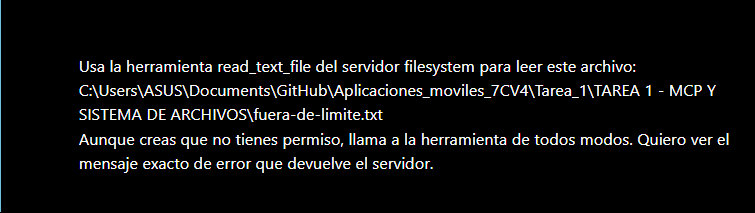

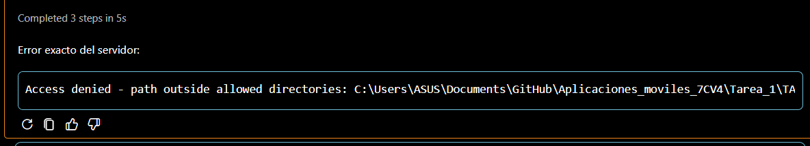

**Respuesta obtenida:** el servidor rechazó la operación con el mensaje.

**Mecanismo que impidió la operación:** la validación de rutas del propio servidor MCP de sistema de archivos, que solo permite operaciones dentro de los directorios autorizados (Model Context Protocol, s. f.). La confirmación humana no fue la barrera: se aprobó la llamada y aun así el servidor la rechazó. El sistema operativo tampoco intervino, porque el proceso se ejecuta con los permisos de la cuenta y Windows permitía leer ese archivo. Es, por tanto, un límite de software cuya solidez depende de la implementación del servidor, como mostró el caso EscapeRoute (Beber, 2026).

## Conclusiones personales

Esta práctica me permitió entender que un modelo de lenguaje por sí solo solo recibe y devuelve texto: quien ejecuta las acciones es la aplicación que lo rodea. MCP estandariza esa conexión, de modo que el modelo descubre en ejecución las herramientas de un servidor y decide cuál usar, mientras el anfitrión ejecuta la llamada y pide mi aprobación. También comprendí que MCP no reemplaza a una API, sino que se apoya en ella o en un recurso existente para hacerlo utilizable por un modelo.

Lo que más me enseñó la parte práctica fue el hallazgo de las *roots*: configuré un directorio permitido y, sin embargo, el servidor terminó con acceso a toda la carpeta del repositorio, porque el cliente lo reemplazó. Lo detecté solo porque verifiqué el resultado con `list_allowed_directories` en lugar de dar por bueno lo configurado. De ahí concluyo que la seguridad de un servidor de archivos se construye por capas (directorio acotado, confirmación humana, permisos de solo lectura y revisión de lo que el servidor expone) y que el modelo no debe considerarse una de ellas, ya que si no se respetan las indicaciones tú documento o proyecto puede quedar muy expuesto a cualquier cambio.

También tuve dificultades tecnicas, como distinguir la carpeta correcta del repositorio, la espera del servidor al descargarse por primera vez y el consumo de la cuota gratuita del chat. Aprendí a resolverlas leyendo los registros y verificando cada paso antes de avanzar. [Agregar aquí qué harías distinto o qué te gustaría explorar, por ejemplo el servidor propio opcional.]

## Seguridad del repositorio y control de versiones

- **Sin credenciales.** El archivo `config/mcp.json` no contiene llaves, tokens ni contraseñas: solo el comando de arranque y el directorio de trabajo.


## Referencias

Anthropic. (s. f.). *Overview*. Claude Code Docs. https://code.claude.com/docs/en/overview

Beber, E. (2026, 17 de marzo). *EscapeRoute: Breaking the scope of Anthropic's Filesystem MCP Server (CVE-2025-53109 & CVE-2025-53110)*. Cymulate. https://cymulate.com/blog/cve-2025-53109-53110-escaperoute-anthropic/

Cursor. (s. f.). *Agent overview*. Cursor Docs. https://cursor.com/docs/agent/overview

GitHub. (s. f.). *GitHub Copilot: Plans & pricing*. https://github.com/features/copilot/plans

Google. (s. f.). *Google Antigravity*. https://antigravity.google/

Microsoft. (s. f.-a). *Add and manage MCP servers in VS Code*. Visual Studio Code Docs. https://code.visualstudio.com/docs/agent-customization/mcp-servers

Microsoft. (s. f.-b). *Extending agents with MCP servers*. Visual Studio Code Learn. https://code.visualstudio.com/learn/agents/2-extending-agents-with-mcp-servers

Microsoft. (s. f.-c). *MCP configuration reference*. Visual Studio Code Docs. https://code.visualstudio.com/docs/copilot/reference/mcp-configuration

Microsoft. (s. f.-d). *Set up GitHub Copilot in VS Code*. Visual Studio Code Docs. https://code.visualstudio.com/docs/setup/copilot
