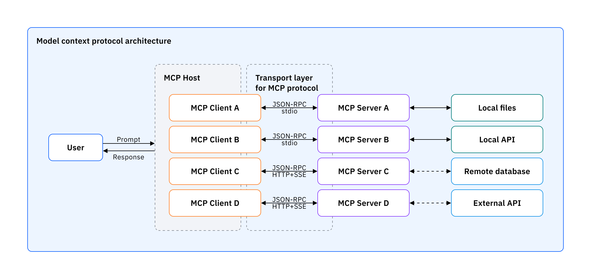

# TAREA 1 - MCP Y SISTEMA DE ARCHIVOS
Investigación e implementación de un MCP

**4. ARQUITECTURA DE MCP**

El Model Context Protocol (MCP) sigue una arquitectura con tres roles. El host es la aplicación de IA con la que interactúa la persona usuaria, por ejemplo un asistente conversacional o un editor con IA. Crea y administra los clientes, controla sus permisos y su ciclo de vida, aplica las políticas de seguridad y de consentimiento, toma las decisiones de autorización y coordina la integración con el modelo de lenguaje. Cada cliente es un componente que el host crea para comunicarse con exactamente un servidor, de modo que la relación entre clientes y servidores es 1:1. Además, adjunta a cada petición la versión del protocolo y sus capacidades. La documentación aclara que el host es la aplicación con la que se interactúa, mientras que los clientes son los componentes a nivel de protocolo que hacen posibles las conexiones. Por último, el servidor es el programa que ofrece contexto y capacidades especializadas mediante las primitivas de MCP. Puede ser un proceso local o un servicio remoto y debe respetar las restricciones de seguridad. Los mensajes entre cliente y servidor usan JSON-RPC 2.0.

**Arquitectura y componentes de MCP**

El protocolo de contexto del modelo tiene una estructura clara con componentes que trabajan juntos para ayudar a los LLM y a los sistemas externos a interactuar fácilmente.

**Host de MCP:**El LLM está contenido en el host de MCP, una aplicación o entorno de IA, como un IDE potenciado por IA o una IA conversacional. Este suele ser el punto de interacción del usuario, en el que el host de MCP usa el LLM para procesar solicitudes que pueden requerir datos o herramientas externas.

**Cliente de MCP:**El cliente de MCP, ubicado en el host de MCP, ayuda a que el LLM y el servidor de MCP se comuniquen entre sí. Traduce las solicitudes del LLM para el MCP y convierte las respuestas del MCP para el LLM. También encuentra y usa los servidores de MCP disponibles.

**Servidor de MCP:**El servidor de MCP es el servicio externo que proporciona contexto, datos o capacidades al LLM. Ayuda a los LLM conectándose a sistemas externos como bases de datos y servicios web, traduciendo sus respuestas a un formato que el LLM pueda entender, lo que ayuda a los desarrolladores a proporcionar diversas funcionalidades.

**Capa de transporte:**La capa de transporte usa mensajes JSON-RPC 2.0 para comunicarse entre el cliente y el servidor, principalmente a través de dos métodos de transporte:

**Entrada/salida estándar (stdio):** Funciona bien para recursos locales y ofrece una transmisión de mensajes rápida y síncrona.

**Eventos enviados por el servidor (SSE):** Se prefieren para recursos remotos, lo que permite una transmisión de datos eficiente y en tiempo real.

**Arquitectura del Model Context Protocol**

## 4.2 Primitivas del servidor

Un servidor ofrece sus capacidades mediante tres primitivas, que se distinguen por quién controla su uso.

| Primitiva | Qué es | Quién la controla | Operaciones del protocolo |
|---|---|---|---|
| Herramientas (*tools*) | Funciones que el modelo puede invocar y que pueden escribir en bases de datos, llamar APIs o modificar archivos | El modelo | `tools/list`, `tools/call` |
| Recursos (*resources*) | Fuentes de datos pasivas y de solo lectura (contenido de archivos, esquemas de bases de datos), identificadas con un URI y un tipo MIME | La aplicación | `resources/list`, `resources/templates/list`, `resources/read`, `subscriptions/listen` |
| Plantillas de prompt (*prompts*) | Plantillas de instrucciones parametrizadas que guían al modelo en el uso de herramientas y recursos | La persona usuaria | `prompts/list`, `prompts/get` |

Las **herramientas** son interfaces definidas con JSON Schema, cada una con una operación y entradas y salidas tipadas. Pueden exigir el consentimiento de la persona antes de ejecutarse, y las aplicaciones suelen implementarlo con diálogos de aprobación, permisos preautorizados o registros de actividad. Los **recursos** pueden ser directos, con un URI fijo, o plantillas de recursos con parámetros (por ejemplo, `travel://activities/{city}/{category}`), y la aplicación decide cómo presentarlos al modelo. Las **plantillas de prompt** requieren una invocación explícita, típicamente mediante comandos con barra diagonal o paletas de comandos . En el servidor de sistema de archivos de este trabajo, la funcionalidad se ofrece principalmente como herramientas: leer contenido y estructura de directorios, crear archivos y carpetas, moverlos o renombrarlos y buscarlos por nombre o contenido .

## 4.3 Primitivas del cliente

Además de consumir el contexto de los servidores, los clientes pueden ofrecer funciones que permiten a los servidores construir interacciones más ricas (Model Context Protocol, 2026f).

| Primitiva | Qué permite | Estado en la revisión 2026-07-28 |
|---|---|---|
| Elicitation | Que el servidor pida información específica a la persona durante una interacción | Vigente |
| Roots | Que el cliente indique al servidor en qué directorios debe concentrarse | Obsoleta (*deprecated*) |
| Sampling | Que el servidor solicite completaciones del modelo a través del cliente | Obsoleta (*deprecated*) |

**Elicitation** evita exigir toda la información por adelantado o fallar cuando falta un dato: el servidor puede pausar su operación y pedir una entrada concreta. Tiene dos modos: En el modo formulario, el servidor envía un esquema con el que el cliente construye un formulario y valida la respuesta. En el modo URL, el servidor entrega una dirección que la persona abre fuera del cliente, de modo que los datos no pasan por él ni por el contexto del modelo, lo que lo hace adecuado para credenciales o autorizaciones OAuth. Por eso el modo formulario no debe usarse para solicitar contraseñas, llaves ni tokens.

**Roots** son URIs `file://` con los que el cliente comunica los límites del sistema de archivos sobre los que el servidor debe operar. La especificación los describe como un mecanismo de coordinación y no como una frontera de seguridad: los servidores "deberían" respetarlos, no están obligados a imponerlos, porque ejecutan código que el cliente no controla. La seguridad real debe aplicarse en el sistema operativo, mediante permisos de archivos o aislamiento . Esta distinción importa para el servidor de sistema de archivos.

**Sampling** permite que un servidor use el modelo del cliente sin integrarse directamente con un proveedor de modelos, con revisión humana de la solicitud y de la respuesta.

En la revisión 2025-11-25, se especifica que mantenía una sesión con estado entre cliente y servidor, estas capacidades se negociaban como funciones del cliente. La revisión 2026-07-28 declaró obsoletas roots, sampling y logging: siguen funcionando durante al menos doce meses, pero las nuevas implementaciones no deberían adoptarlas. Cuando un servidor necesita información del cliente, ahora responde con un resultado de tipo `InputRequiredResult` que contiene la solicitud, y el cliente reintenta la petición original con las respuestas adjuntas. A este patrón se le llama *Multi Round-Trip Requests.

## 4.4 Transportes

Un transporte es la forma en que se enmarcan y entregan los mensajes JSON-RPC, sus reglas no cambian el significado de los mensajes, que es el mismo en cualquier transporte. La especificación define dos transportes estándar.

**stdio.** El cliente lanza el servidor como un subproceso y ambos intercambian mensajes JSON-RPC delimitados por saltos de línea a través de la entrada y la salida estándar. Es el transporte de los servidores locales: no requiere red y el servidor vive mientras el host lo mantenga en ejecución. La especificación establece que los clientes deberían soportar stdio siempre que sea posible, y que el servidor no debe escribir en su salida estándar nada que no sea un mensaje válido de MCP, reservando el error estándar para el registro (*logging*). Es el transporte que usa el ejemplo instalado, ya que el host lanza el servidor con el comando `npx`.

**Streamable HTTP.** Es el transporte para servidores remotos, cada mensaje se envía como una petición HTTP POST a un único punto de acceso de MCP, y la respuesta llega como un objeto JSON o como un flujo SSE asociado a esa petición. En este transporte, los metadatos de cada petición se reflejan en encabezados HTTP para que balanceadores y pasarelas puedan enrutarla sin leer el cuerpo del mensaje. Este transporte reemplazó al antiguo HTTP+SSE de la revisión 2024-11-05, que quedó obsoleto desde la revisión 2025-03-26; SSE se conserva únicamente como mecanismo opcional de transmisión dentro de Streamable HTTP. Además de estos dos, la especificación permite implementar transportes personalizados (Model Context Protocol, 2026e).

## 4.5 Versión de la especificación consultada

Este documento está escrito sobre la especificación del Model Context Protocol, **revisión 2026-07-28**, que fue publicada el 28 de julio de 2026 y consultada el 20 de septiembre de 2026. Es la versión más reciente disponible en esa fecha. Esta revisión introdujo un protocolo sin estado, en el que cada petición es autocontenida y lleva su propia versión y capacidades, además de hacer obsoletas roots, sampling y logging (Model Context Protocol, 2026a; 2026b). Como la especificación se actualiza con frecuencia, las descripciones de las secciones 4.1 y 4.3 se contrastaron con la revisión anterior, 2025-11-25, que mantenía sesiones con estado (Model Context Protocol, 2025a).

## Referencias

Model Context Protocol. (2026e). *Transports* (versión 2026-07-28). https://modelcontextprotocol.io/specification/2026-07-28/basic/transports

Model Context Protocol. (2026f). *Understanding MCP clients*. https://modelcontextprotocol.io/docs/2026-07-28/learn/client-concepts

Model Context Protocol. (2026g). *Understanding MCP servers*. https://modelcontextprotocol.io/docs/2026-07-28/learn/server-concepts
