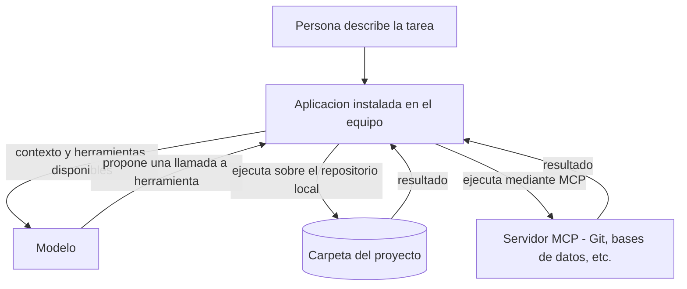

# TAREA 1 - MCP Y SISTEMA DE ARCHIVOS
Investigación 

## 7. Casos de uso

MCP se ha convertido en un estándar de la industria: Anthropic reportó que fue adoptado por ChatGPT, Cursor, Gemini, Microsoft Copilot y Visual Studio Code, entre otros (Anthropic, 2025). En esta sección se describen cinco herramientas concretas que lo implementan y se explica cómo permiten trabajar con repositorios completos sin subir archivos manualmente.

### 7.1 Herramientas actuales que implementan MCP

#### Claude Code

Claude Code es la herramienta de codificación agéntica de Anthropic: lee el código, edita archivos, ejecuta comandos y se integra con las herramientas de desarrollo, y está disponible en la terminal, en extensiones de IDE, en una aplicación de escritorio y en el navegador. Usa MCP para conectarse con fuentes externas al repositorio: la documentación oficial menciona leer documentos de diseño en Google Drive, actualizar tickets en Jira, obtener datos de Slack o usar herramientas propias . Los servidores se agregan con el comando `claude mcp add` y pueden configurarse con alcance local, de proyecto (compartido con el equipo) o de usuario (Anthropic, s. f.-a).

#### Visual Studio Code con GitHub Copilot

En Visual Studio Code, el modo agente de GitHub Copilot planifica el trabajo, determina los archivos y el contexto relevantes, edita el código y usa herramientas, y revisa el resultado para iterar hasta resolver los problemas. MCP le aporta herramientas para tareas como operaciones con archivos, bases de datos o APIs externas, además de recursos y prompts. La configuración se guarda en un archivo `mcp.json`, en el espacio de trabajo (`.vscode/mcp.json`) o en el perfil de usuario.

#### Cursor

Cursor es un editor con un agente capaz de completar tareas de programación de forma independiente, ejecutar comandos en la terminal y editar código. Utiliza MCP para conectarse con herramientas y fuentes de datos externas, de modo que el desarrollador no tenga que explicar repetidamente su proyecto: los servidores se instalan desde la interfaz o se configuran en `mcp.json`, por proyecto o de forma global (Cursor, s. f.-b). Cursor soporta los transportes stdio, SSE y Streamable HTTP, y las primitivas de herramientas, recursos, prompts, roots y elicitation (Cursor, s. f.-b).

#### Google Antigravity

Google Antigravity es un entorno de desarrollo agéntico. Sus agentes pueden operar de forma simultánea y autónoma sobre el editor, la terminal y el navegador: por ejemplo, escribir el código de una nueva función, iniciar un servidor local desde la terminal y probar la función en el navegador (Google, 2025). Además del editor, ofrece una superficie de administración (*Manager*) para lanzar y supervisar varios agentes, y su familia actual incluye el IDE, una interfaz de línea de comandos, un SDK y un centro de control de agentes (Google, s. f.). En cuanto a MCP, dispone de una tienda de servidores desde la que se instalan, por ejemplo, servidores que conectan a los agentes con servicios de datos de Google Cloud como AlloyDB, BigQuery, Spanner, Cloud SQL y Looker. Otros servidores, como el de Azure, se agregan desde el administrador de servidores MCP del panel del agente, editando el archivo de configuración `mcp_config.json` (Microsoft, s. f.-b).

#### Qwen Code

Qwen Code es un agente de programación de código abierto que se ejecuta en la terminal y utiliza los modelos de la familia Qwen; en este caso, la herramienta es Qwen Code y no Qwen. Carga sus servidores MCP desde el objeto `mcpServers` del archivo `settings.json` o mediante el comando `qwen mcp add`. La documentación señala que, con servidores MCP conectados, se le puede pedir que trabaje con archivos y repositorios (leer, buscar y escribir, según las herramientas habilitadas), que consulte bases de datos, que integre servicios internos y que automatice flujos de trabajo repetitivos (QwenLM, s. f.).

#### Resumen

| Herramienta | Tipo | Configuración de MCP | Uso de MCP |
|---|---|---|---|
| Claude Code | Agente de programación (terminal, IDE, escritorio, web) | `claude mcp add`; alcance local, de proyecto o de usuario | Documentos en Drive, tickets en Jira, datos de Slack, herramientas propias |
| Visual Studio Code con GitHub Copilot | Editor con modo agente | `mcp.json` en el espacio de trabajo o en el perfil | Operaciones con archivos, bases de datos y APIs externas |
| Cursor | Editor con agente | `mcp.json` por proyecto o global; stdio, SSE y Streamable HTTP | Integración directa del agente con las herramientas del desarrollador |
| Google Antigravity | Entorno de desarrollo agéntico | Tienda de servidores MCP y `mcp_config.json` | Servicios de datos y de nube (BigQuery, AlloyDB, Azure) desde el flujo de desarrollo |
| Qwen Code | Agente de programación en la terminal | `mcpServers` en `settings.json` o `qwen mcp add` | Archivos y repositorios, bases de datos, servicios internos y automatizaciones |

### 7.2 Cómo editan repositorios completos sin subir archivos manualmente

En un chat web, el modelo solo ve lo que la persona pega o adjunta, lo que obliga al flujo manual de copiar y pegar descrito en el punto 2. Las herramientas anteriores funcionan de otra manera: son aplicaciones instaladas en el equipo de quien programa, con acceso directo a la carpeta del proyecto. En palabras de la documentación de Claude Code, a diferencia de Claude.ai tiene acceso directo a los archivos, la terminal y todo el código, y en lugar de copiar y pegar fragmentos de un lado a otro, entra y hace el trabajo por sí mismo.

El mecanismo es el bucle agéntico. Un agente es un modelo de lenguaje que opera en un ciclo con acceso a herramientas, y las herramientas y los permisos determinan lo que puede hacer. El modelo no abre los archivos: propone una llamada a una herramienta, la aplicación la ejecuta sobre el repositorio local y devuelve el resultado, y el ciclo se repite hasta terminar la tarea.

Este ciclo explica varias cosas:

1. **No hace falta indicar los archivos.** En el modo agente de VS Code, la persona puede especificar un requisito de alto nivel sin indicar en qué archivos trabajar, y Copilot determina de forma autónoma el contexto y los archivos que editar. Claude Code utiliza búsqueda agéntica para comprender la estructura y las dependencias del proyecto sin que se seleccionen archivos de contexto manualmente.
2. **El repositorio no se envía completo.** Las herramientas dan al agente medios para explorarlo y leer solo lo necesario. El agente de Cursor cuenta con herramientas para hacer búsquedas semánticas en el código indexado, buscar archivos por nombre y por patrones, leer archivos, editarlos y ejecutar comandos, sin un límite en el número de llamadas por tarea; el agente obtiene el contexto bajo demanda mediante búsquedas exactas y semánticas. Así se editan proyectos completos, archivo por archivo, sin cargarlos enteros en el contexto del modelo.
3. **Las ediciones cruzan varios archivos y se verifican.** Un agente puede refactorizar una función y actualizar todos los archivos que la usan, ejecutar la compilación o las pruebas y usar el resultado para decidir el siguiente paso. Claude Code también trabaja directamente con Git: prepara cambios, escribe mensajes de *commit*, crea ramas y abre solicitudes de cambio.
4. **Los agentes actúan en varias superficies.** En Antigravity, un mismo agente escribe código, usa la terminal y controla el navegador para comprobar que la función nueva funciona (Google, 2025).

### 7.3 Dónde interviene MCP

Conviene precisar el papel de MCP, porque no explica por sí solo la edición de repositorios. Herramientas como Claude Code o Cursor traen sus propias herramientas internas para leer, buscar y editar archivos y ejecutar comandos. MCP es el mecanismo estándar para añadir capacidades adicionales mediante servidores: repositorios remotos, bases de datos, gestores de tareas, documentación o servicios de nube (Anthropic, s. f.-b; Microsoft, s. f.-a; Google Cloud, 2025). Como el protocolo es el mismo, un servidor escrito una vez puede conectarse a distintas aplicaciones, que es la ventaja de reutilización señalada en el punto 3. En los clientes cuya funcionalidad sobre archivos proviene de un servidor MCP, como en el ejemplo de este trabajo con Claude Desktop, el servidor de sistema de archivos cumple exactamente ese papel: da acceso a un directorio autorizado de la computadora sin que la persona suba los archivos (Model Context Protocol, 2026c).

Dos precisiones finales. Primero, que no se suban archivos manualmente no significa que no salgan del equipo: el contenido que el agente lee se envía como contexto al proveedor del modelo, salvo que se ejecute un modelo local, como se señaló en el punto 2. Segundo, esta comodidad exige los controles descritos en la sección 6. Cursor guarda instantáneas del código (*checkpoints*) antes de hacer cambios significativos y Claude Code se integra con Git (Anthropic, s. f.-, lo que ayuda a revertir errores. En Qwen Code, la opción `trust: true` de un servidor omite las confirmaciones, por lo que debe usarse con cautela (QwenLM, s. f.).

## Referencias

Anthropic. (s. f.-a). *Connect Claude Code to tools via MCP*. Claude Code Docs. https://code.claude.com/docs/en/mcp

Anthropic. (s. f.-b). *Overview*. Claude Code Docs. https://code.claude.com/docs/en/overview

Anthropic. (s. f.-c). *What is Claude Code?* Claude Code 101, Claude Academy. https://academy.claude.com/courses/claude-code-101/what-is-claude-code

Anthropic. (s. f.-d). *Claude Code by Anthropic*. https://claude.com/product/claude-code

Anthropic. (2025, 9 de diciembre). *Donating the Model Context Protocol and establishing the Agentic AI Foundation*. https://anthropic.com/news/donating-the-model-context-protocol-and-establishing-of-the-agentic-ai-foundation

Cursor. (s. f.-a). *Agent overview*. Cursor Docs. https://cursor.com/docs/agent/overview

Cursor. (s. f.-b). *Model Context Protocol (MCP)*. Cursor Docs. https://cursor.com/docs/mcp

Cursor. (2026, 9 de enero). *Best practices for coding with agents*. https://cursor.com/blog/agent-best-practices

Google. (s. f.). *Google Antigravity*. https://antigravity.google/

Google. (2025, 18 de noviembre). *Introducing Google Antigravity, a new era in AI-assisted software development*. Google Antigravity Blog. https://antigravity.google/blog/introducing-google-antigravity

Google Cloud. (2025, 16 de diciembre). *Connect Google Antigravity IDE to Google's Data Cloud services*. Google Cloud Blog. https://cloud.google.com/blog/products/data-analytics/connect-google-antigravity-ide-to-googles-data-cloud-services

